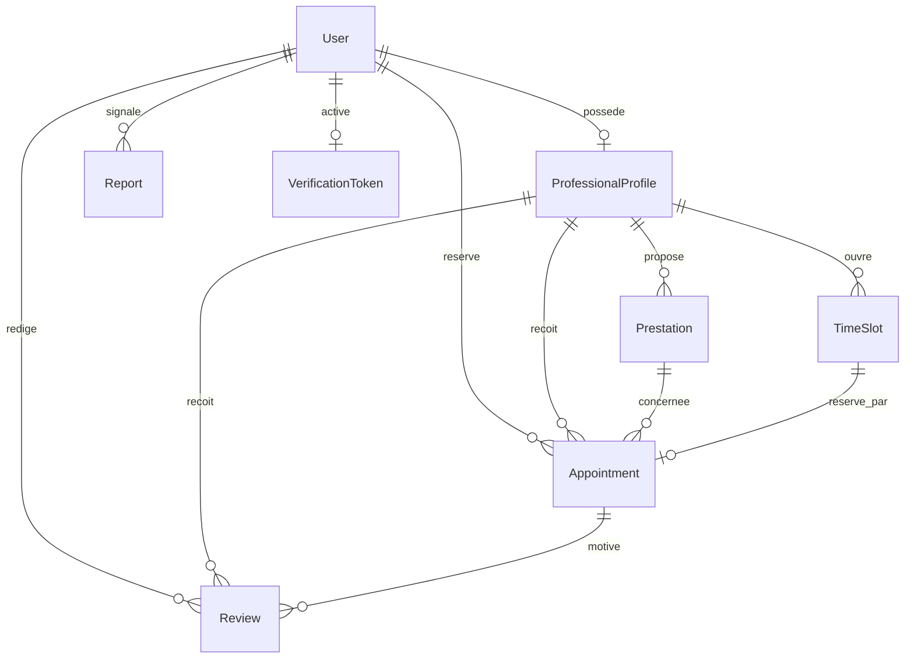
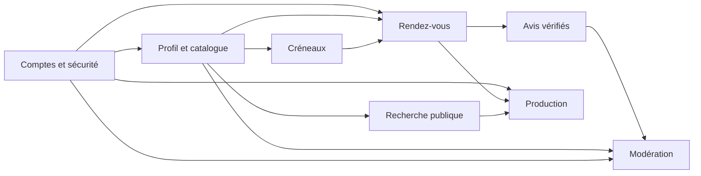

# 1. Vue d'ensemble

Audit du dépôt local, branche `feature/ulrich-activation-rdv-audit`, le 28/09/2026. La modification locale de `src/main/resources/application.properties` était déjà présente et n'a pas été intégrée à l'audit comme une version livrée sur `main`.

| Élément | Constat vérifié |
|---|---|
| Architecture | Monolithe MVC rendu serveur : `controller/` → `service/` → `repository/` → `model/`, formulaires dans `dto/`, accès dans `security/`, vues `src/main/resources/templates/`. `HomeController.home` et `SearchController.search` illustrent le rendu Thymeleaf. |
| Exemple de requête | `GET /recherche` → `SearchController.search` → `ProfessionalService.search` → `ProfessionalProfileRepository.search` → `search/results.html` ; `SearchController.search` appelle aussi `ReviewService.getAverageRating` pour chaque résultat. |
| Versions déclarées | Java 21 ; Spring Boot **4.0.8** ; plugin `io.spring.dependency-management` **1.1.7** (`build.gradle`). Bootstrap **5.3.3**, Bootstrap Icons **1.11.3** (`templates/fragments/head.html`). PostgreSQL local **16-alpine** (`docker-compose.yml`). Versions exactes des starters, driver PostgreSQL, H2 et Lombok : **NON TROUVÉ** dans `build.gradle` (gérées par le BOM). Wrapper Gradle **8.14.3** (`gradle/wrapper/gradle-wrapper.properties`). |
| Configuration | `src/main/resources/application.properties` : `DB_HOST`, `DB_PORT`, `DB_NAME`, `DB_USER`, `DB_PASSWORD`, `ADMIN_EMAIL`, `ADMIN_PASSWORD`; JPA `ddl-auto=update`, OSIV désactivé ; fichier test H2 en mémoire, `ddl-auto=create-drop` (`src/test/resources/application-test.properties`). Aucun profil de production : **NON TROUVÉ**. |
| Écarts README/code | Le README annonce un SMTP local et des variables `MAIL_*` ; la modification locale actuelle de `application.properties` contient un hôte SMTP distant et des identifiants en clair. Le README annonce des tests H2, mais `BeautyConnectApplicationTests.contextLoads` est le seul test. Le README ne décrit ni `VerificationToken`, ni Mailpit, ni les comptes Sarah/Léa créés par `DataInitializer.run`. |

# 2. Modèle de données

Toutes les entités sont dans `src/main/java/com/beautyconnect/model/` ; clés `Long` auto-générées. `@Column(nullable=false)` est une contrainte SQL ; les contrôles de formulaire se trouvent dans `dto/`.

| Entité | Champs principaux | Relations et cardinalités | Contraintes observées |
|---|---|---|---|
| `User` | email, password, firstName, lastName, phone, role, enabled, createdAt | 1–0..1 `ProfessionalProfile`; 1–N rendez-vous/avis/signalements | email unique et obligatoire, rôle/nom/prénom/password obligatoires (`User.java`) |
| `ProfessionalProfile` | businessName, bio, city, address, profilePhotoUrl, targetGender, validated | N–1 `User` côté FK unique ; 1–N prestations/créneaux/rendez-vous/avis | `user_id` unique, businessName/city obligatoires ; photo URL stockée sans upload (`ProfessionalProfile.java`) |
| `Prestation` | name, description, type, price, durationMinutes, active | N–1 `ProfessionalProfile`; 1–N `Appointment` | prix `precision=8,scale=2`, champs clés non nuls (`Prestation.java`) |
| `TimeSlot` | startDateTime, available | N–1 `ProfessionalProfile`; 1–0..1 `Appointment` | date non nulle ; aucune unicité `(professional_id,start_date_time)` (`TimeSlot.java`) |
| `Appointment` | status, notes, createdAt | N–1 `User` client, `ProfessionalProfile`, `Prestation` ; 1–1 `TimeSlot` | `time_slot_id` unique ; statut obligatoire (`Appointment.java`) |
| `Review` | rating, comment, hidden, createdAt | N–1 `User` client/profil ; N–0..1 `Appointment` | note non nulle mais plage 1–5 seulement dans `ReviewForm.java` (`Review.java`) |
| `Report` | targetType, targetId, reason, status, createdAt | N–1 `User` reporter ; cible polymorphe sans FK | `targetId` non nul, aucune FK vers avis/profil (`Report.java`) |
| `VerificationToken` | token, expiryDate | 1–1 `User` déclaré côté Java | token unique ; `user_id` non déclaré unique (`VerificationToken.java`) |

Points d'attention : aucun `@Index` explicite sur ville, dates et FK (`model/*.java`) ; aucune cascade déclarée ; `ProfessionalProfileRepository.search` utilise un `LIKE %ville%` ; `TimeSlot` autorise deux débuts identiques ; `Review.appointment` est facultatif et `ReviewService.addReview` ne le renseigne jamais ; `Report.targetId` peut viser un objet inexistant. Les vues lisent des relations `LAZY` après retour du service alors que OSIV est désactivé (`application.properties:24`, par exemple `templates/client/appointments.html:21-24`) : risque concret de `LazyInitializationException`. `SearchController.search` déclenche une requête d'avis par résultat : N+1.

# 3. Inventaire fonctionnel détaillé

| Fonctionnalité | Statut | Contrôleur(s) | Service(s) | Templates | Tests existants | Ce qui manque |
|---|---|---|---|---|---|---|
| Inscription client/pro | 🟡 partielle | `AuthController.registerClient/registerProfessional` | `UserService.registerClient/registerProfessional`, `AuthTokenService` | `auth/register-*` | démarrage seul | Échec SMTP bloque l'inscription ; URL d'activation locale fixe ; relance du lien absente. |
| Connexion, activation | 🟡 partielle | `AuthController.loginPage/activateAccount`, Spring Security | `CustomUserDetailsService`, `AuthTokenService` | `auth/login` | démarrage seul | Expiration configurée à 15 min mais codée à 24 h ; statut activé distinct du statut bloqué absent. |
| Profil professionnel privé/public | 🟡 partielle | `ProfessionalDashboardController.updateProfile`, `ProfessionalPublicController.viewProfile` | `ProfessionalService` | `professional/profile*` | démarrage seul | Profil non validé accessible par URL directe ; photo non chargée ; validation serveur du profil insuffisante. |
| Prestations et durées | 🟡 partielle | `ProfessionalDashboardController.prestations/addPrestation/removePrestation` | `ProfessionalService` | `professional/prestations` | démarrage seul | Édition/réactivation absentes ; durée non liée à la fin d'un créneau. |
| Créneaux | 🟡 partielle | `ProfessionalDashboardController.timeSlots/addTimeSlot/removeTimeSlot` | `ProfessionalService` | `professional/slots` | démarrage seul | Chevauchements/doublons non contrôlés ; suppression d'un créneau réservé possible côté service. |
| Recherche ville/type/sexe | 🟡 partielle | `SearchController.search` | `ProfessionalService.search`, `ReviewService.getAverageRating` | `search/results`, `index` | démarrage seul | Recherche par nom précis absente ; pagination/index ; exclusion des comptes désactivés non vérifiée. |
| Rendez-vous et confirmation/refus | 🟡 partielle | `AppointmentController.book/cancel`, `ProfessionalDashboardController.confirmAppointment/refuseAppointment/completeAppointment` | `AppointmentService` | `professional/profile`, `client/appointments`, `professional/appointments` | démarrage seul | Transitions de statut non contrôlées ; course de réservation ; durée, passé, prestation inactive et profil non validé non vérifiés. |
| Mail de confirmation | 🟡 partielle | `ProfessionalDashboardController.confirmAppointment` | `EmailService.sendAppointmentConfirmation` | aucun | démarrage seul | SMTP non isolé en production ; transaction couplée à l'envoi ; rappels/refus absents. |
| Avis | 🟡 partielle | `ReviewController.addReview`, `AdminController.hideReview` | `ReviewService` | `professional/profile`, `admin/reviews` | démarrage seul | N'importe quel client connecté peut noter ; rendez-vous terminé et unicité non vérifiés ; `appointmentId` ignoré. |
| Signalements | 🟡 partielle | `ReportController.reportReview/reportProfile`, `AdminController.treatReport/rejectReport` | `ReportService` | `professional/profile`, `admin/reports` | démarrage seul | Cible non vérifiée ; traiter ne masque ni ne désactive automatiquement ; peu de contexte de modération. |
| Admin validation et métriques | 🟡 partielle | `AdminController` | `AdminService` | `admin/*` | démarrage seul | Métriques limitées à quatre comptes/profils ; activation admin confondue avec validation d'email ; vues `LAZY` fragiles. |
| Paiement | ❌ absente | — | — | — | — | Hors périmètre demandé. |

# 4. Routes et sécurité

Routes relevées dans `src/main/java/com/beautyconnect/controller/*.java` ; `POST /connexion` et `POST /deconnexion` sont fournis par `SecurityConfig.securityFilterChain`.

| HTTP | URL | Contrôleur.méthode | Rôle | Vue ou redirection |
|---|---|---|---|---|
| GET | `/`, `/accueil` | `HomeController.home` | public | `index` |
| GET | `/erreur/403` | `HomeController.accessDenied` | public | `error/403` |
| GET | `/connexion` | `AuthController.loginPage` | public | `auth/login` |
| POST | `/connexion` | Spring Security `formLogin` | public | accueil selon rôle |
| POST | `/deconnexion` | Spring Security `logout` | connecté | `/?deconnecte` |
| GET/POST | `/inscription/client` | `AuthController.clientRegistrationForm/registerClient` | public | `auth/register-client` / `/connexion` |
| GET/POST | `/inscription/professionnel` | `AuthController.professionalRegistrationForm/registerProfessional` | public | `auth/register-professional` / `/connexion` |
| GET | `/activer-compte` | `AuthController.activateAccount` | public | `/connexion` |
| GET | `/recherche` | `SearchController.search` | public | `search/results` |
| GET | `/professionnels/{id}` | `ProfessionalPublicController.viewProfile` | public | `professional/profile` |
| GET | `/client/tableau-bord` | `ClientDashboardController.dashboard` | CLIENT | `client/dashboard` |
| GET | `/client/rendez-vous` | `ClientDashboardController.appointments` | CLIENT | `client/appointments` |
| POST | `/rendez-vous/reserver/{professionalId}` | `AppointmentController.book` | CLIENT | `/professionnels/{id}` |
| POST | `/rendez-vous/{id}/annuler` | `AppointmentController.cancel` | CLIENT | `/client/rendez-vous` |
| POST | `/avis/professionnels/{professionalId}` | `ReviewController.addReview` | CLIENT | `/professionnels/{id}` |
| POST | `/signalements/avis/{reviewId}` | `ReportController.reportReview` | CLIENT | `/client/tableau-bord` |
| POST | `/signalements/profils/{professionalId}` | `ReportController.reportProfile` | CLIENT | `/professionnels/{id}` |
| GET | `/pro/tableau-bord` | `ProfessionalDashboardController.dashboard` | PROFESSIONAL | `professional/dashboard` |
| GET/POST | `/pro/profil` | `ProfessionalDashboardController.editProfileForm/updateProfile` | PROFESSIONAL | `professional/profile-edit` / `/pro/profil` |
| GET/POST | `/pro/prestations` | `ProfessionalDashboardController.prestations/addPrestation` | PROFESSIONAL | `professional/prestations` / `/pro/prestations` |
| POST | `/pro/prestations/{id}/supprimer` | `ProfessionalDashboardController.removePrestation` | PROFESSIONAL | `/pro/prestations` |
| GET/POST | `/pro/creneaux` | `ProfessionalDashboardController.timeSlots/addTimeSlot` | PROFESSIONAL | `professional/slots` / `/pro/creneaux` |
| POST | `/pro/creneaux/{id}/supprimer` | `ProfessionalDashboardController.removeTimeSlot` | PROFESSIONAL | `/pro/creneaux` |
| GET | `/pro/rendez-vous` | `ProfessionalDashboardController.appointments` | PROFESSIONAL | `professional/appointments` |
| POST | `/pro/rendez-vous/{id}/confirmer` | `ProfessionalDashboardController.confirmAppointment` | PROFESSIONAL | `/pro/rendez-vous` |
| POST | `/pro/rendez-vous/{id}/refuser` | `ProfessionalDashboardController.refuseAppointment` | PROFESSIONAL | `/pro/rendez-vous` |
| POST | `/pro/rendez-vous/{id}/terminer` | `ProfessionalDashboardController.completeAppointment` | PROFESSIONAL | `/pro/rendez-vous` |
| GET | `/admin/tableau-bord` | `AdminController.dashboard` | ADMIN | `admin/dashboard` |
| GET | `/admin/professionnels` | `AdminController.professionals` | ADMIN | `admin/professionals` |
| POST | `/admin/professionnels/{id}/valider` | `AdminController.validateProfessional` | ADMIN | `/admin/professionnels` |
| POST | `/admin/utilisateurs/{id}/desactiver` | `AdminController.disableUser` | ADMIN | `/admin/professionnels` |
| POST | `/admin/utilisateurs/{id}/activer` | `AdminController.enableUser` | ADMIN | `/admin/professionnels` |
| GET | `/admin/avis` | `AdminController.reviews` | ADMIN | `admin/reviews` |
| POST | `/admin/avis/{id}/masquer` | `AdminController.hideReview` | ADMIN | `/admin/avis` |
| GET | `/admin/signalements` | `AdminController.reports` | ADMIN | `admin/reports` |
| POST | `/admin/signalements/{id}/traiter` | `AdminController.treatReport` | ADMIN | `/admin/signalements` |
| POST | `/admin/signalements/{id}/rejeter` | `AdminController.rejectReport` | ADMIN | `/admin/signalements` |

`SecurityConfig.securityFilterChain` : formulaire/session Spring Security, `CustomUserDetailsService.loadUserByUsername` lit l'email, BCrypt dans `SecurityConfig.passwordEncoder`, rôles via `CustomUserDetails.getAuthorities`. CSRF reste activé par défaut ; les formulaires `th:action` POST utilisent l'intégration Thymeleaf/Spring, à vérifier par test MVC. Configuration de session personnalisée : **NON TROUVÉ**.

| Gravité | Constat et preuve |
|---|---|
| Critique avant production | Configuration SMTP actuelle avec identifiants en clair (`application.properties:37-47`, modification locale) ; retirer du dépôt et révoquer si jamais réels. `DataInitializer.run` crée trois comptes et mots de passe connus à chaque démarrage ; `app.admin.password` a une valeur par défaut (`application.properties:50-51`). |
| Élevée | `ProfessionalPublicController.viewProfile` accepte un profil non validé ; `AppointmentService.book` ne vérifie ni `validated`, ni `User.enabled`. `ReviewService.addReview` accepte un avis sans achat terminé. |
| Élevée | `AppointmentService.book` lit puis met à jour `TimeSlot.available` sans verrou/version ; unicité FK évite deux lignes finales mais une seconde requête peut finir en erreur technique. |
| Moyenne | `AppointmentService.confirm/refuse/cancelByClient/markCompleted` n'imposent pas le cycle d'état ; `AuthTokenService.generateAndSendActivationLink` encode `localhost` ; `server.error.include-message=always` et DEBUG dans `application.properties:54-55`. |

# 5. Qualité du code et dette technique

| Sujet | Constat |
|---|---|
| Tests | `BeautyConnectApplicationTests.contextLoads` est le seul test. Profil H2 configuré dans `application-test.properties`; aucune preuve de cycle métier. `./gradlew test --offline` n'a pas pu démarrer dans ce poste : cache Gradle local en lecture seule ; avec `GRADLE_USER_HOME=/tmp/beautyconnect-gradle`, la distribution absente nécessite un téléchargement interdit par le réseau du sandbox. Exécution réelle H2 : **À VÉRIFIER** en CI. |
| Duplication/taille | `ProfessionalDashboardController` regroupe profil, prestations, créneaux, rendez-vous (~200 lignes) ; ses méthodes répètent la recherche du profil et les flash messages. `AuthController` duplique la logique de formulaire client/pro. |
| Logique/erreurs | `SearchController.search` calcule les moyennes une par une ; `GlobalExceptionHandler` gère 404/400 mais pas `EmailAlreadyUsedException` hors contrôleur ni les échecs SMTP. `ProfessionalDashboardController.updateProfile` lie des `@RequestParam` sans validation. |
| Bug probable | `ProfessionalService.removeTimeSlot` supprime aussi un créneau réservé, alors que `Appointment.time_slot_id` le référence ; FK violée. `ReviewService.addReview` ignore `ReviewForm.appointmentId`. `AuthTokenService.activateAccount` supprime le token expiré puis lance une exception dans une transaction : suppression susceptible d'être annulée. |
| Écart commentaire/code | `AppointmentStatus.java` dit que les transitions sont contrôlées dans `AppointmentService`, mais le service change le statut sans état préalable ; `AppointmentRepository.existsByClientAndProfessionalAndStatus` est déclaré mais non utilisé. |
| Goulots Git | `SecurityConfig.java`, `ProfessionalDashboardController.java`, `professional/profile.html`, `fragments/*`, `custom.css`, `application.properties`, `build.gradle`, modèles `User/ProfessionalProfile/Appointment`. Attribution exclusive et petites PR demandées. |

# 6. Dépendances entre modules

Ordre logique : 1) contrat d'identité/activation + tokens UI ; 2) profil/catalogue/créneaux ; 3) réservation ; 4) avis et modération ; 5) durcissement et déploiement. En parallèle, chaque lot écrit ses tests ; Emmanuelle met la CI et les migrations en place dès le début, Ulrich prépare Render après réception de ce socle. Preuves : injections dans `UserService`, `ProfessionalService`, `AppointmentService`, `ReviewService`, `ReportService` et `AdminController`.

# 7. Proposition de découpage en 5 lots de travail parallélisables

Les **5 lots de code** sont confiés à Ulrich, Anaelle, Manuel, Teddy et Emmanuelle. Joyce est la **6e personne**, responsable du design et de l'intégration des éléments communs. Le guide commun Git/design/Render est `docs/ROADMAP-EQUIPE.md` ; chaque personne a sa fiche et son prompt dans `docs/roadmaps/`.

| Lot / responsable | Objectif, tâches de 0,5–2 j | Écriture principale ; lecture/prudence | Dépendances ; concepts | Difficulté / charge | Terminé quand… |
|---|---|---|---|---|---|
| 1 Ulrich | Activation/config (1 j) ; RDV fiables (2,5 j) ; recherche/carte (2,5 j) ; proches et chemin à pied (3 j) ; tests (1,5 j) ; Docker/Render/recette (2,5 j) | `AuthController`, `AppointmentController/Service`, `SearchController`, `templates/client/*`, `search/results.html`, nouveau `RoutingClient`, `Dockerfile`, `render.yaml` ; config avec accord | Données pro d'Anaelle, migrations/CI d'Emmanuelle ; Security, JPA, GPS, Docker, tests | 5/5 · 14–16 j | Un seul RDV par créneau, proches mesurés, trajet piéton, lien bus, tests et déploiement Render validé. |
| 2 Anaelle | Visibilité/profil (2 j) ; CRUD prestation (2,5 j) ; coordonnées publiables (1,5 j) ; portfolio (1,5 j) ; tests (1 j) | `ProfessionalService`, `ProfessionalPublicController`, `PrestationRepository`, templates `professional/profile*`/`prestations.html` ; lire recherche d'Ulrich | Interface images d'Emmanuelle, tokens Joyce ; JPA, MVC, Thymeleaf | 4/5 · 8–9 j | Propriétaire vérifié, CRUD complet, seuls profils validés publics, images gérées. |
| 3 Manuel | Extraire routes pro (1 j) ; sécurité des créneaux (2,5 j) ; vues agenda (2 j) ; tests (1,5 j) | nouveau `ProfessionalSchedulingController`, `TimeSlotRepository/Form`, templates `professional/slots.html`/`appointments.html` ; contrôleur commun une fois | États RDV d'Ulrich ; JPA FK, validation, MVC | 4/5 · 7–8 j | Routes inchangées, doublons/suppression dangereuse bloqués, agenda testé. |
| 4 Teddy | Avis vérifiés (2,5 j) ; signalements/modération (2,5 j) ; métriques/vues/tests (2 j) | `AdminController/Service`, `ReviewController/Service`, `ReportController/Service`, repositories et templates admin ; lire `AppointmentRepository` | État `TERMINE` d'Ulrich ; rôles, JPA, tests MVC | 4/5 · 7–8 j | Un avis par RDV terminé, cibles vérifiées et décisions admin testées. |
| 5 Emmanuelle | CI (1 j) ; config/prod (2 j) ; migrations (1,5 j) ; images (2,5 j) ; tests d'intégration/recette/sauvegardes (3 j) | `.github/workflows/*`, `application-prod.properties`, migrations, adaptateur image, tests/rapport de recette ; Docker/Render en lecture | Contrats de tous ; Gradle, PostgreSQL, Cloudinary, tests | 4/5 · 9–11 j | CI verte, secrets hors Git, images persistantes, parcours testés et restauration démontrée avant Render. |

**Joyce, lot design transverse (7–8 j, difficulté 3/5)** : système visuel et maquettes (1 j), `custom.css`/`fragments/*` (1,5 j), accueil et auth (2,5 j), composants et revue responsive/accessibilité de chaque PR (2 j). Elle lit les vues métier ; chaque propriétaire implémente sa page avec ses tokens. Le travail d'Ulrich est plus long à cause de la carte, du calcul d'itinéraire et de Render demandés ; les tâches U5–U10 peuvent démarrer après les contrats coordonnées/migration, et U12–U13 après la recette d'Emmanuelle. Le contrôleur pro commun est transféré lors de la première PR de Manuel.

# 8. Backlog d'évolution priorisé

Effort en jours-personne. Les lignes marquées `README.md` reprennent ses cinq pistes d'évolution ; les autres proviennent du code audité ou des demandes de l'équipe. MoSCoW décrit la priorité proposée pour une première mise en ligne.

| Priorité | Évolution | Effort | Lot |
|---|---|---:|---|
| Must | Supprimer secrets/valeurs de production du code ; désactiver les comptes démo et password admin par défaut en prod | 1 | Emmanuelle + Ulrich |
| Must | Transitions RDV, concurrence, disponibilité et durée cohérentes | 2 | Ulrich + Manuel |
| Must | Tests unitaires et d'intégration complémentaires (`README.md`) | 4 répartis | Tous + Emmanuelle |
| Must | Migration `ddl-auto=update` vers Flyway/Liquibase (`README.md`) | 1,5 | Emmanuelle |
| Must | Corriger lectures `LAZY`/OSIV et rendre les pages de listes fiables | 1,5 | Chaque propriétaire + Emmanuelle |
| Must | CI et configuration Render/PostgreSQL, URL publique d'activation | 2 | Emmanuelle (CI/config) + Ulrich (Render) |
| Should | Upload photos de profil et réalisations (`README.md`) | 3–5 | Anaelle + Emmanuelle + Joyce |
| Should | Notifications email complètes, rappels/refus (`README.md`) | 2–3 | Ulrich |
| Should | Recherche précise par nom, pagination, états vides et filtres accessibles | 2 | Ulrich + Joyce |
| Should | Avis vérifiés et modération des cibles | 2 | Teddy |
| Should | Design responsive, contrastes, états d'erreur, SEO de base | 3 | Joyce + propriétaires |
| Should | Géolocalisation GPS, carte, proches par trajet et chemin piéton (`README.md` pour GPS/carte ; trajet ajouté par l'équipe) | 5–7 | Ulrich + Anaelle + Emmanuelle |
| Could | Calendrier avancé et règles d'annulation | 3 | Manuel + Ulrich |
| Won't (périmètre) | Paiement | — | Aucun |

# 9. Pédagogie : ce qu'un nouveau développeur doit comprendre

| Concept | Exemple réel (extrait <10 lignes) | Rôle |
|---|---|---|
| `@Entity`, `@Column` | `model/User.java` : `@Entity` puis `@Table(name = "users")` ; `@Column(nullable = false, unique = true) private String email;` | Mappage/contrainte SQL. |
| `@ManyToOne`, `LAZY` | `model/Appointment.java` : `@ManyToOne(fetch = FetchType.LAZY, optional = false)` puis `private User client;` | FK chargée à la demande. |
| `@Transactional` | `service/AppointmentService.java` : `@Transactional public Appointment book(...) { ... }` | Une unité de transaction pour réserver. |
| `JpaRepository` | `repository/UserRepository.java` : `Optional<User> findByEmail(String email);` | Requête dérivée du nom. |
| `@Query` | `repository/ProfessionalProfileRepository.java` : `SELECT DISTINCT p FROM ProfessionalProfile p ... WHERE p.validated = true` | Recherche JPQL. |
| `@Valid` / `BindingResult` | `controller/AppointmentController.java` : `@Valid @ModelAttribute AppointmentForm appointmentForm, BindingResult bindingResult` | Valide le formulaire ; ordre des paramètres obligatoire. |
| `SecurityFilterChain` | `config/SecurityConfig.java` : `.requestMatchers("/admin/**").hasRole("ADMIN")` | Contrôle d'accès serveur. |
| `@AuthenticationPrincipal` | `controller/ClientDashboardController.java` : `dashboard(@AuthenticationPrincipal CustomUserDetails principal, Model model)` | Utilisateur connecté. |
| Thymeleaf `th:*` | `templates/search/results.html` : `<form th:action="@{/recherche}" th:object="${searchCriteria}" method="get">` ; `<input th:field="*{city}"/>` | Liaison URL/DTO. |
| `sec:authorize` | `templates/fragments/navbar.html` : `<li ... sec:authorize="hasRole('ADMIN')">` | Masque des éléments UI ; n'assure pas la sécurité serveur. |
| `@PrePersist` | `model/User.java` : `@PrePersist protected void onCreate() { this.createdAt = LocalDateTime.now(); }` | Date à l'insertion. |

**Cinq parcours de bout en bout** :

1. Client : `AuthController.registerClient` → `UserService.registerClient` → `UserRepository.save` → `AuthTokenService.generateAndSendActivationLink` → `AuthController.activateAccount` → `CustomUserDetailsService.loadUserByUsername` → `client/dashboard.html`. Mail local nécessaire actuellement.
2. Recherche : `index.html` → `SearchController.search` → `ProfessionalService.search` → `ProfessionalProfileRepository.search` → `search/results.html` → `ProfessionalPublicController.viewProfile` → `professional/profile.html`.
3. Pro : `AuthController.registerProfessional` → `UserService.registerProfessional` → `AdminController.validateProfessional` → `AdminService.validateProfessional` → `ProfessionalDashboardController.addPrestation/addTimeSlot` → `ProfessionalService` → `professional/prestations.html` et `professional/slots.html`.
4. RDV : `professional/profile.html` → `AppointmentController.book` → `AppointmentService.book` → `AppointmentRepository`/`TimeSlotRepository` → `ProfessionalDashboardController.confirmAppointment` → `EmailService.sendAppointmentConfirmation` → `client/appointments.html`.
5. Avis/modération : `professional/profile.html` → `ReviewController.addReview` → `ReviewService.addReview` → `ReportController.reportReview` → `ReportService.create` → `AdminController.reviews/reports` → `ReviewService.hide` ou `ReportService.updateStatus` → `admin/reviews.html`/`admin/reports.html`.

Pièges : `sec:authorize` n'est pas une permission serveur ; ne pas lier un formulaire à `User` directement ; conserver `BindingResult` immédiatement après l'objet `@Valid` ; ne pas lire les relations `LAZY` dans la vue sans requête adaptée ; ne pas tester le mail avec un vrai SMTP ; ne pas confondre `validated` et `enabled` ; ne pas supprimer physiquement une prestation référencée (`ProfessionalService.removePrestation`) ; l'URL `localhost` de `AuthTokenService` ne marche pas sur Render.

# 10. Conventions et risques

Conventions observées : packages par couche (`controller/service/repository/model/dto`) ; classes en anglais, URL/messages en français ; méthodes métier en anglais ; DTO suffixés `Form` ; repositories `findBy...` ; vues par rôle (`templates/client`, `professional`, `admin`) ; redirection POST/Redirect/GET avec `RedirectAttributes`. Pas de convention explicite de commit/branche : **NON TROUVÉ** ; voir `docs/ROADMAP-EQUIPE.md` pour la proposition.

| Rang | Risque | Mitigation / responsable |
|---:|---|---|
| 1 | Identifiants SMTP visibles dans la config locale | Variables d'environnement et rotation si réels ; Emmanuelle. |
| 2 | Comptes démo/identifiants par défaut en production | Initialiseur limité à `dev`, configuration admin sans défaut ; Emmanuelle/Ulrich. |
| 3 | Pages cassées par `LAZY` avec OSIV désactivé | Requêtes `JOIN FETCH`/DTO et tests MVC ; tous. |
| 4 | Double réservation concurrente | Verrou/contrainte, test concurrent ; Ulrich. |
| 5 | Transitions RDV incohérentes | Machine d'états explicite, tests ; Ulrich/Manuel. |
| 6 | Réservation de profil non validé ou service inactif | Contrôle métier avant `save`; Anaelle/Ulrich. |
| 7 | Avis non vérifiés | FK rendez-vous terminé et unicité ; Teddy. |
| 8 | Perte de données avec `ddl-auto=update` | Migrations SQL et restauration testée ; Emmanuelle, puis déploiement par Ulrich. |
| 9 | Mail bloquant la transaction / lien local en prod | URL publique configurable, envoi après commit ou file ; Ulrich/Emmanuelle. |
| 10 | Conflits Git sur contrôleur pro et fragments | Propriétaires, extraction précoce, petites PR ; Manuel/Joyce. |

Questions ouvertes : 1) Emmanuelle accepte-t-elle le lot qualité/images/recette proposé (rôle initial **NON TROUVÉ**) ? 2) L'activation mail est-elle obligatoire pour la démonstration locale et la production ? 3) Une réservation doit-elle bloquer un créneau jusqu'à refus/annulation, même si le pro ne répond jamais ? 4) Un professionnel non validé peut-il consulter son espace privé ? 5) Les photos seront-elles stockées sur un service objet externe (nécessaire si stockage local Render non persistant) ? 6) Quel budget Render et quel domaine public sont prévus ?

**Résumé exécutif (estimation issue du code, non mesure de couverture)** : environ **60 %** du périmètre fonctionnel a une première implémentation ; aucun parcours critique n'est solidement testé. Forces : architecture MVC lisible ; rôles et formulaires séparés ; périmètre de démonstration large. Faiblesses : tests quasi absents ; sécurité/configuration de production non prêtes ; logique de réservation/avis incomplète. Trois premières actions : isoler secrets et comptes démo ; faire tourner CI/H2 ; verrouiller et tester les parcours réservation/activation.
